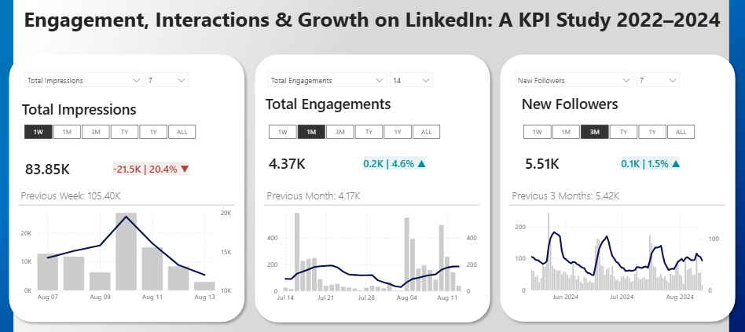

# linkedin-performance-KPI-card
_Personal LinkedIn engagement insights displayed through KPI card visualization in Power BI._

***
Table of Contents

- [Project Background](#project-background)
- [Executive Summary](#executive-summary)
- [Data Preparation](#data-preparation)
- [Dashboard Overview](#dashboard-overview)
- [Key Insights](#key-insights)
- [Caveats](#caveats)

***

## Project Background

A personal dataset collected from LinkedIn over a three-year period — 2022, 2023, and 2024 — captures key engagement metrics including total interactions, audience growth, and follower trends. This project recreates a professional Power BI dashboard to display and explore these KPIs through dynamic cards, time-based comparisons, and moving averages. Built as part of a guided learning exercise, the dashboard is designed to enable users to interactively filter data across multiple dimensions and quickly extract targeted insights on content performance and audience behavior.

## Executive Summary

This dashboard presents an overview of LinkedIn performance metrics from 2022 to 2024, focusing on three key areas: total impressions, engagements, and follower growth. Across the full period, impressions totaled 8.44 million, with 86.7K total engagements and 43.6K new followers. While engagement and follower numbers have generally trended upward year-over-year, impressions saw a notable drop in 2024, down 43.9% compared to the previous year. The dashboard allows users to view performance across different time windows — from one week to one year — and compare current metrics against previous periods through interactive filters, moving averages, and visual indicators.

## Data Preparation

The dataset, exported from a personal LinkedIn account, required minimal cleaning and was loaded directly into Power BI. A custom calendar table was created using Bravo for Power BI to enable time intelligence functions such as period-over-period comparisons and moving averages.

Roughly 30 DAX measures were developed to power the interactivity of the dashboard. These include:

-	**Base measures** for tracking total values such as engagements, impressions, and follower growth;
-	**Selector-driven calculations** to dynamically display values based on user input (e.g., time ranges and KPI types);
-	**Time-window logic** for calculating moving averages, current vs. previous period metrics, and growth percentages;
-	**Formatting measures** for adjusting visual elements like number formatting, conditional indicators (e.g., up/down arrows), font color, and axis scaling.
  
These measures work together to create a responsive, visually intuitive dashboard tailored to user selections.

Dataset ERD

## Dashboard Overview

The dashboard is built around three KPI cards — Impressions, Engagements, and New Followers — each offering a focused view of platform performance. Users can switch between KPIs and choose custom time windows (1W, 1M, 3M, TY, 1Y, ALL) using dropdown slicers. Each card displays the total metric value, a directional indicator with percentage change, and a comparative reference to the previous equivalent period. A combined bar and line chart at the bottom visualizes trends over time, with a moving average overlay to smooth short-term fluctuations. Conditional formatting is applied to highlight growth or decline dynamically.

## Key Insights

-	Impressions dropped by 43.9% this year compared to last (3.36M vs. 4.21M);
-	New followers grew 16.4% year-over-year, from 20.13K to 23.43K;
-	Engagements rose 15.3% over the last 12 months, totaling 46.4K;
-	The most recent 3-month engagement period shows a decline of 9.8%;
-	Engagement and follower growth rebounded in the last month after prior dips;
-	Week-over-week impressions vary significantly, from 83.8K to over 100K.

***

## Caveats

-	**Learning Project:** This dashboard was built as a learning exercise by following a publicly available [YouTube tutorial](https://www.youtube.com/watch?v=ZFZmqdECBMs&t=694s). The visual structure and many of the DAX patterns are replicated for educational purposes and to practice Power BI development techniques.
-	**Data Ownership:** The data used in this project originates from the content creator’s own [LinkedIn](linkedin.com/in/injae-park) analytics. It was not self-collected, and no proprietary or sensitive information is included. Full credit goes to the original author for sharing the dataset.
-	**Limited Business Context:** While the dashboard effectively demonstrates time-based KPI tracking and dynamic visuals, it does not reflect a real business scenario with strategic objectives, audience targeting, or deeper engagement drivers.
-	**Static Dataset:** The dataset covers the years 2022–2024 and is not updated dynamically. Insights are valid only for the data range provided.

***

